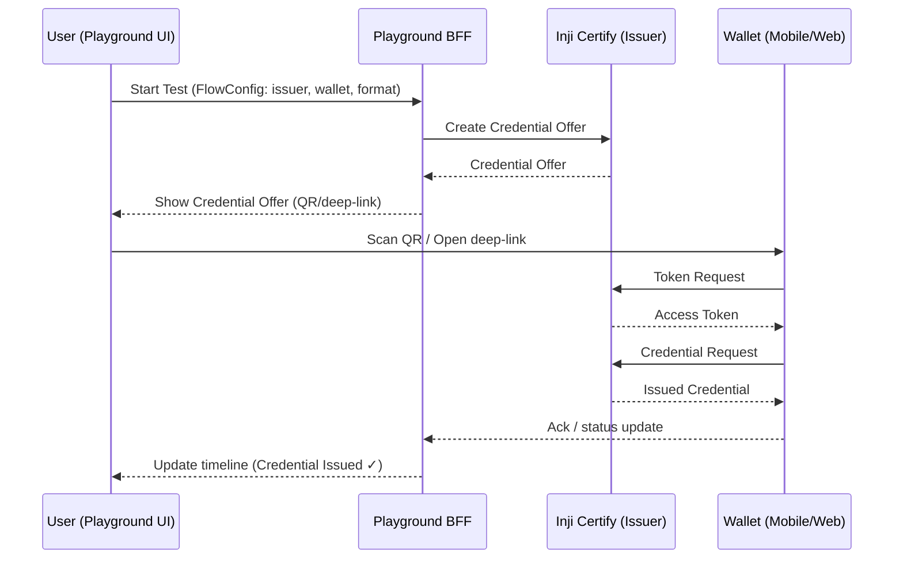
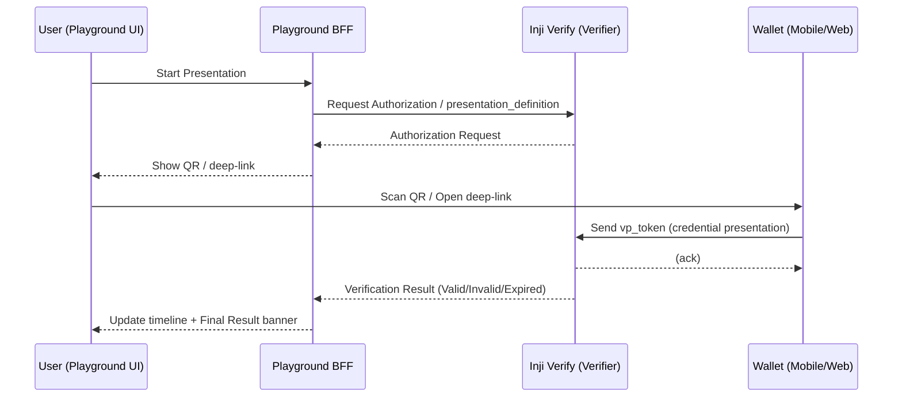
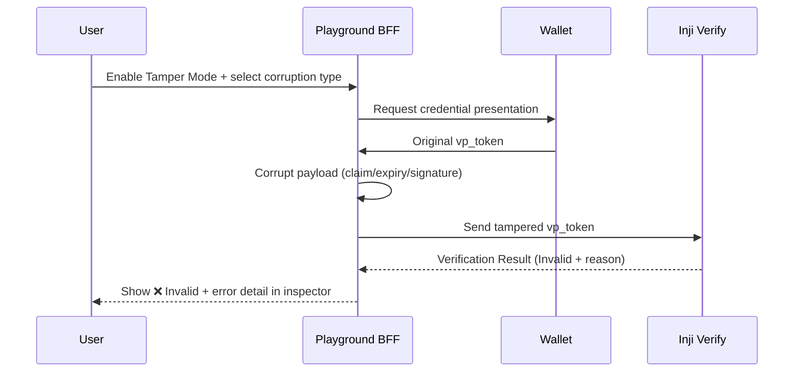
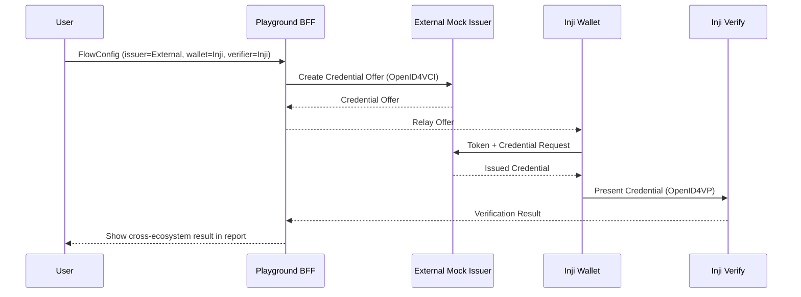

# Sequence Diagrams

## 1. Issuance Flow (OpenID4VCI)

```mermaid
sequenceDiagram
    participant U as User (Playground UI)
    participant B as Playground BFF
    participant I as Inji Certify (Issuer)
    participant W as Wallet (Mobile/Web)

    U->>B: Start Test (FlowConfig: issuer, wallet, format)
    B->>I: Create Credential Offer
    I-->>B: Credential Offer
    B-->>U: Show Credential Offer (QR/deep-link)
    U->>W: Scan QR / Open deep-link
    W->>I: Token Request
    I-->>W: Access Token
    W->>I: Credential Request
    I-->>W: Issued Credential
    W-->>B: Ack / status update
    B-->>U: Update timeline (Credential Issued ✓)
```

## 2. Presentation & Verification Flow (OpenID4VP)

```mermaid
sequenceDiagram
    participant U as User (Playground UI)
    participant B as Playground BFF
    participant V as Inji Verify (Verifier)
    participant W as Wallet (Mobile/Web)

    U->>B: Start Presentation
    B->>V: Request Authorization / presentation_definition
    V-->>B: Authorization Request
    B-->>U: Show QR / deep-link
    U->>W: Scan QR / Open deep-link
    W->>V: Send vp_token (credential presentation)
    V-->>W: (ack)
    V-->>B: Verification Result (Valid/Invalid/Expired)
    B-->>U: Update timeline + Final Result banner
```

## 3. Tamper Mode Flow (Good-to-have)

```mermaid
sequenceDiagram
    participant U as User
    participant B as Playground BFF
    participant W as Wallet
    participant V as Inji Verify

    U->>B: Enable Tamper Mode + select corruption type
    B->>W: Request credential presentation
    W->>B: Original vp_token
    B->>B: Corrupt payload (claim/expiry/signature)
    B->>V: Send tampered vp_token
    V-->>B: Verification Result (Invalid + reason)
    B-->>U: Show ❌ Invalid + error detail in inspector
```

## 4. Cross-Ecosystem Flow (Good-to-have)

```mermaid
sequenceDiagram
    participant U as User
    participant B as Playground BFF
    participant EI as External Mock Issuer
    participant W as Inji Wallet
    participant V as Inji Verify

    U->>B: FlowConfig (issuer=External, wallet=Inji, verifier=Inji)
    B->>EI: Create Credential Offer (OpenID4VCI)
    EI-->>B: Credential Offer
    B-->>W: Relay Offer
    W->>EI: Token + Credential Request
    EI-->>W: Issued Credential
    W->>V: Present Credential (OpenID4VP)
    V-->>B: Verification Result
    B-->>U: Show cross-ecosystem result in report
```
